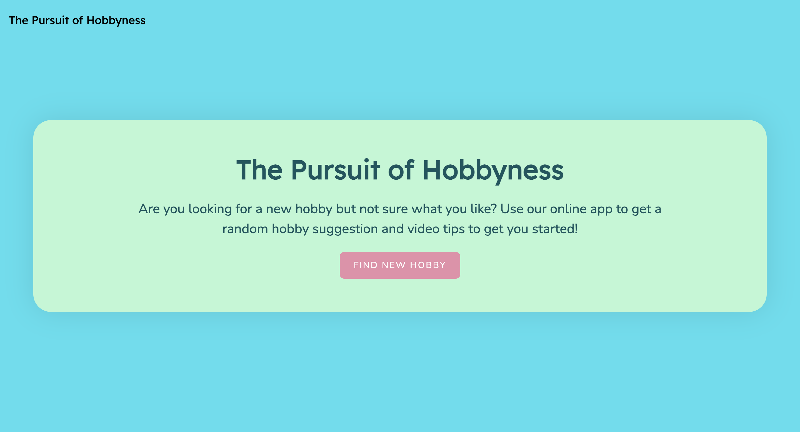

# The Pursuit of Hobbyness: An Interactive Web Application

## Collaborators
- Goergie Lillington : https://github.com/georgielill
- Richard Llewellyn : https://github.com/RichLlew182
- Chrisma Stephen : https://github.com/chrisma89

## Overview

"The Pursuit of Hobbyness" is an innovative web application designed to inspire users in discovering and embracing new hobbies. Grounded in the philosophy of Larry Page's words, "You never lose a dream, it just incubates as a hobby," this platform serves as a digital incubator for dreams and aspirations through hobby exploration.

## Core Functionality

The application greets users with an engaging and user-friendly interface, accompanied by a motivational prompt: "Are you looking for a new hobby but not sure what you like? Use our online app to get a random hobby suggestion and video tips to get you started!" This is further complemented by an inviting "Find New Hobby" button.

### Hobby Categories and Selection

Upon interaction, users are presented with a curated selection of six diverse hobby categories:

- General
- Sports and Outdoors
- Collection
- Observation
- Education
- Competition

Each category, carefully designed to encompass a wide range of interests, guides users in their journey towards finding a hobby that resonates with their personal preferences.

### Interactive Hobby Exploration

Selecting a category triggers the display of a suggested hobby title alongside four interactive buttons, each serving a unique purpose in the user's exploratory journey:

1. **Pursue Hobby**: A key feature that enriches the user experience by embedding a collection of six videos related to the hobby directly onto the webpage. This feature also smartly incorporates the hobby into the user's local storage for future reference.

2. **What is**: This button links to a Wikipedia page, providing comprehensive information about the selected hobby, aiding users in making an informed decision.

3. **New SameCategory Hobby**: Allows users to dynamically generate another hobby within the same category, facilitating continuous exploration.

4. **Start Over**: Resets the application to its initial state, enabling users to restart their exploration journey from scratch.

### My Saved Hobbies

A pivotal aspect of the application is the "My hobbies" button, which becomes active once a hobby is saved. Clicking on this button navigates the user to the "My Saved Hobbies" page. This section showcases the six categories again, each with a dropdown list revealing the saved hobbies. Selecting a hobby from the list revisits the related videos, ensuring a seamless and engaging user experience. In cases where no hobbies are saved under a category, the application thoughtfully displays a "No hobbies to view yet" message.

### Seamless Navigation

The application is designed with an intuitive navigation system. The navbar, prominently featuring "The Pursuit of Hobbyness," serves as a quick link back to the homepage at any point, ensuring a fluid and user-centric navigational experience.

## Technical Summary

"The Pursuit of Hobbyness" employs responsive design, dynamic content generation, and efficient local storage utilisation. The platform's architecture is built to foster an interactive and educational environment, making the exploration of new hobbies both accessible and engaging.

In essence, "The Pursuit of Hobbyness" is more than just an application; it's a digital companion in the journey of self-discovery and personal growth through the pursuit of hobbies.

## Built with

This repository has been built using

- HTML5
- CSS3
- Javascript
- jQuery
- Git
- Github
- Browser APIs
- Server APIs
- Bootstrap
- Figma
- Excalidraw

The API's in use are

- https://api-ninjas.com/api/hobbies
- https://developers.google.com/youtube/v3

## Resources:

### Resources for collaborative working

- https://docs.github.com/en/pull-requests/collaborating-with-pull-requests/addressing-merge-conflicts/resolving-a-merge-conflict-using-the-command-line
- https://docs.github.com/en/pull-requests/collaborating-with-pull-requests/addressing-merge-conflicts/resolving-a-merge-conflict-on-github

### Resources on building the webpage

- https://developers.google.com/youtube/v3/docs
- https://developer.mozilla.org/en-US/docs/Web/JavaScript/Reference/Global_Objects/Object
- https://hansen-breanna.github.io/local-storage.html
- https://developers.google.com/youtube/player_parameters
- https://en.wikipedia.org/wiki/Wikipedia:Copyrights

### Installation

This webpage can be rendered by visiting the url : https://chrisma89.github.io/The-Pursuit-of-Hobbyness/
The code can be viewed at github: https://github.com/chrisma89/The-Pursuit-of-Hobbyness

### Usage

The screenshots of the webpage are below:

### Credits

- Thank you to the TAs, Mr Zakariya Hussain and Mr Martin William for their guidance throughout the project.

### Licence

The standard MIT Licence is in use for this repository.
